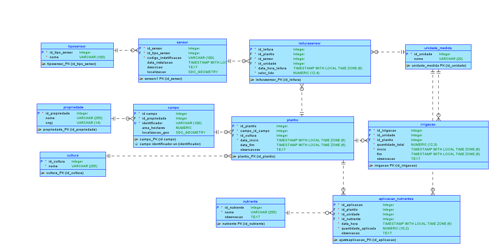
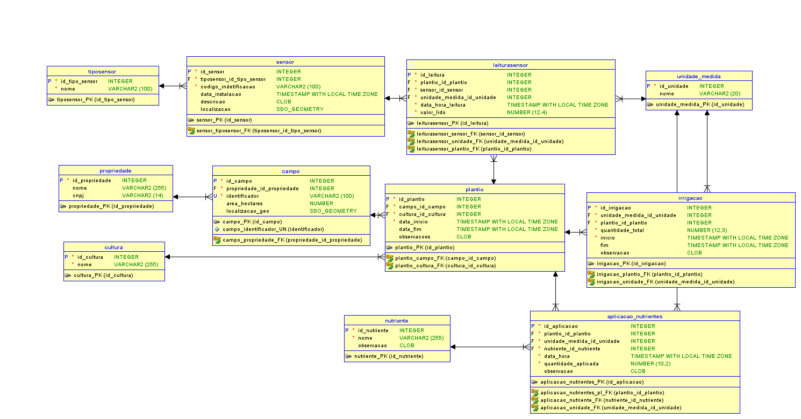

# FIAP - Faculdade de Informática e Administração Paulista

 

# Um mapa do tesouro

## Grupo 28

## 👨‍🎓 Integrantes: 
- Vide arquivo separado na entrega no sistema da FIAP
## 👩‍🏫 Professores:
### Tutor(a) 
- <a href="https://www.linkedin.com/company/inova-fusca">Lucas Gomes Moreira</a>
### Coordenador(a)
- <a href="https://www.linkedin.com/company/inova-fusca">André Godoi</a>

## 📜 Descrição

Este projeto visa modelar um banco de dados relacional para a FarmTech Solutions. O objetivo é armazenar e analisar dados coletados por sensores em plantações (umidade, pH, nutrientes P e K) para otimizar a aplicação de água e nutrientes, visando aumentar a produção agrícola.

O banco de dados deve suprir as seguintes necessidades:

* **O produtor planta diferentes culturas que requerem monitoramento contínuo**  
  - Tabelas: `plantio`, `campo`, `cultura`.  
  - Atributos:  
    - `plantio.campo_id_campo`: Relaciona o plantio ao campo.  
    - `plantio.cultura_id_cultura`: Relaciona o plantio à cultura.  
    - `plantio.data_inicio` e `plantio.data_fim`: Determinam o período de monitoramento.  
    - `campo.identificador`: Identifica o campo monitorado.  
    - `cultura.nome`: Nome da cultura plantada.  

* **Sensores coletam dados em tempo real e enviam para um sistema central.**  
  - Tabelas: `sensor`, `leiturasensor`, `tiposensor`.  
  - Atributos:  
    - `sensor.codigo_indetificacao`: Identifica o sensor.  
    - `sensor.localizacao`: Localização do sensor no campo.  
    - `leiturasensor.data_hora_leitura`: Registra o momento da leitura.  
    - `leiturasensor.valor_lido`: Valor coletado pelo sensor.  
    - `tiposensor.nome`: Tipo de dado coletado (ex: umidade, pH).  

* **O sistema processa os dados e sugere ajustes na irrigação e aplicação de nutrientes.**  
  - Tabelas: `leiturasensor`, `irrigacao`, `aplicacao_nutrientes`.  
  - Atributos:  
    - `leiturasensor.valor_lido`: Dados coletados para análise.  
    - `irrigacao.quantidade_total`: Quantidade de água aplicada.  
    - `aplicacao_nutrientes.quantidade_aplicada`: Quantidade de nutrientes aplicados.  
    - `aplicacao_nutrientes.data_hora`: Momento da aplicação.  

* **Com base nos dados históricos, o sistema pode prever necessidades futuras e otimizar os recursos.**  
  - Tabelas: `leiturasensor`, `irrigacao`, `aplicacao_nutrientes`.  
  - Atributos:  
    - `leiturasensor.data_hora_leitura`: Histórico de leituras.  
    - `irrigacao.inicio` e `irrigacao.fim`: Histórico de irrigações.  
    - `aplicacao_nutrientes.data_hora`: Histórico de aplicações de nutrientes.  
    - `leiturasensor.valor_lido`: Dados históricos para análise preditiva.  

O banco de dados deve permitir responder perguntas como:

* **Qual foi a data e hora da última aplicação de água?**  
  - **Tabelas**: `irrigacao`.  
  - **Atributos**:  
    - `irrigacao.fim`: Data e hora do fim da irrigação.  
    - `irrigacao.inicio`: Caso `fim` seja nulo, considerar o início da irrigação.  
  - **Consulta**: Ordenar pela coluna `fim` (ou `inicio` se `fim` for nulo) em ordem decrescente e selecionar o primeiro registro.

* **Qual foi a quantidade total de água aplicada em cada mês, por campo?**  
  - **Tabelas**: `irrigacao`, `plantio`, `campo`.  
  - **Atributos**:  
    - `irrigacao.quantidade_total`: Quantidade de água aplicada.  
    - `irrigacao.inicio`: Data da aplicação (para agrupar por mês).  
    - `plantio.campo_id_campo`: Relaciona a irrigação ao campo.  
    - `campo.identificador`: Identificador do campo.  
  - **Consulta**: Agrupar por campo e mês, somando a coluna `quantidade_total`.

* **Como variou o nível de pH do solo num campo específico ao longo do ano?**  
  - **Tabelas**: `leiturasensor`, `sensor`, `tiposensor`, `plantio`, `campo`.  
  - **Atributos**:  
    - `leiturasensor.data_hora_leitura`: Data e hora da leitura.  
    - `leiturasensor.valor_lido`: Valor do pH lido.  
    - `sensor.tiposensor_id_tipo_sensor`: Relaciona o sensor ao tipo de sensor.  
    - `tiposensor.nome`: Nome do tipo de sensor (filtrar por "pH").  
    - `plantio.campo_id_campo`: Relaciona a leitura ao campo.  
    - `campo.identificador`: Identificador do campo.  
  - **Consulta**: Filtrar por campo e tipo de sensor "pH", agrupar por mês e calcular a média dos valores lidos.

* **Quais campos apresentaram níveis de nutrientes (P ou K) fora do ideal para a cultura atual?**  
  - **Tabelas**: `leiturasensor`, `sensor`, `tiposensor`, `plantio`, `campo`, `cultura`.  
  - **Atributos**:  
    - `leiturasensor.valor_lido`: Valor do nutriente lido.  
    - `sensor.tiposensor_id_tipo_sensor`: Relaciona o sensor ao tipo de sensor.  
    - `tiposensor.nome`: Nome do tipo de sensor (filtrar por "Nutriente P" ou "Nutriente K").  
    - `plantio.campo_id_campo`: Relaciona a leitura ao campo.  
    - `campo.identificador`: Identificador do campo.  
    - `plantio.cultura_id_cultura`: Relaciona o plantio à cultura.  
    - `cultura.nome`: Nome da cultura (para determinar os níveis ideais).  
  - **Consulta**: Filtrar por tipo de sensor "Nutriente P" ou "Nutriente K" e comparar os valores lidos com os níveis ideais da cultura.

* **Qual o histórico de leituras de um sensor específico?**  
  - **Tabelas**: `leiturasensor`, `sensor`, `unidade_medida`.  
  - **Atributos**:  
    - `leiturasensor.data_hora_leitura`: Data e hora da leitura.  
    - `leiturasensor.valor_lido`: Valor lido pelo sensor.  
    - `sensor.codigo_indetificacao`: Código de identificação do sensor.  
    - `unidade_medida.nome`: Unidade de medida do valor lido.  
  - **Consulta**: Filtrar por código de identificação do sensor e ordenar por `data_hora_leitura`.

* **Quais sensores estão ativos e onde estão instalados?**  
  - **Tabelas**: `sensor`.  
  - **Atributos**:  
    - `sensor.codigo_indetificacao`: Código de identificação do sensor.  
    - `sensor.localizacao`: Localização geográfica do sensor.  
    - `sensor.data_instalacao`: Data de instalação do sensor.  
  - **Consulta**: Filtrar sensores com localização não nula e listar os atributos mencionados.

## Diagrama Entidade-Relacionamento (DER)

O diagrama visual abaixo representa a estrutura final do banco de dados:

## 📜 Modelo Entidade-Relacionamento (MER)

A imagem abaixo representa o modelo entidade-relacionamento (MER) do banco de dados:

### Entidades e Atributos

#### **aplicacao_nutrientes**
- **id_aplicacao**: INTEGER PRIMARY KEY NOT NULL - Identificador único da aplicação.
- **plantio_id_plantio**: INTEGER FOREIGN KEY NOT NULL - Referência ao plantio.
- **unidade_medida_id_unidade**: INTEGER FOREIGN KEY NOT NULL - Referência à unidade de medida.
- **nutriente_id_nutriente**: INTEGER FOREIGN KEY NOT NULL - Referência ao nutriente.
- **data_hora**: TIMESTAMP WITH LOCAL TIME ZONE NOT NULL - Data e hora da aplicação.
- **quantidade_aplicada**: NUMBER(10,2) NOT NULL - Quantidade aplicada.
- **observacao**: CLOB - Observações adicionais.

#### **campo**
- **id_campo**: INTEGER PRIMARY KEY NOT NULL - Identificador único do campo.
- **propriedade_id_propriedade**: INTEGER FOREIGN KEY NOT NULL - Referência à propriedade.
- **identificador**: VARCHAR2(100) NOT NULL - Nome do campo (ex: lote A1 ou Campo Norte).
- **area_hectares**: NUMBER - Tamanho da área em hectares.
- **localizacao_geo**: MDSYS.SDO_GEOMETRY - Localização geográfica (ex: coordenadas).

#### **cultura**
- **id_cultura**: INTEGER PRIMARY KEY NOT NULL - Identificador único da cultura.
- **nome**: VARCHAR2(255) NOT NULL - Nome da cultura (ex: milho, soja).

#### **irrigacao**
- **id_irrigacao**: INTEGER PRIMARY KEY NOT NULL - Identificador único da irrigação.
- **unidade_medida_id_unidade**: INTEGER FOREIGN KEY NOT NULL - Referência à unidade de medida.
- **plantio_id_plantio**: INTEGER FOREIGN KEY NOT NULL - Referência ao plantio.
- **quantidade_total**: NUMBER(12,3) NOT NULL - Quantidade total de água aplicada.
- **inicio**: TIMESTAMP WITH LOCAL TIME ZONE NOT NULL - Início da irrigação.
- **fim**: TIMESTAMP WITH LOCAL TIME ZONE - Fim da irrigação.
- **observacao**: CLOB - Observações adicionais.

#### **leiturasensor**
- **id_leitura**: INTEGER PRIMARY KEY NOT NULL - Identificador único da leitura.
- **plantio_id_plantio**: INTEGER FOREIGN KEY NOT NULL - Referência ao plantio.
- **sensor_id_sensor**: INTEGER FOREIGN KEY NOT NULL - Referência ao sensor.
- **unidade_medida_id_unidade**: INTEGER FOREIGN KEY NOT NULL - Referência à unidade de medida.
- **data_hora_leitura**: TIMESTAMP WITH LOCAL TIME ZONE NOT NULL - Data e hora da leitura.
- **valor_lido**: NUMBER(12,4) NOT NULL - Valor lido pelo sensor.

#### **nutriente**
- **id_nutriente**: INTEGER PRIMARY KEY NOT NULL - Identificador único do nutriente.
- **nome**: VARCHAR2(255) NOT NULL - Nome do nutriente.
- **observacao**: CLOB - Observações adicionais.

#### **plantio**
- **id_plantio**: INTEGER PRIMARY KEY NOT NULL - Identificador único do plantio.
- **campo_id_campo**: INTEGER FOREIGN KEY NOT NULL - Referência ao campo.
- **cultura_id_cultura**: INTEGER FOREIGN KEY NOT NULL - Referência à cultura.
- **data_inicio**: TIMESTAMP WITH LOCAL TIME ZONE NOT NULL - Data de início do plantio.
- **data_fim**: TIMESTAMP WITH LOCAL TIME ZONE - Data de fim do plantio.
- **observacoes**: CLOB - Observações adicionais.

#### **propriedade**
- **id_propriedade**: INTEGER PRIMARY KEY NOT NULL - Identificador único da propriedade.
- **nome**: VARCHAR2(255) - Nome da propriedade.
- **cnpj**: VARCHAR2(14) - CNPJ da propriedade.

#### **sensor**
- **id_sensor**: INTEGER PRIMARY KEY NOT NULL - Identificador único do sensor.
- **tiposensor_id_tipo_sensor**: INTEGER FOREIGN KEY NOT NULL - Referência ao tipo de sensor.
- **codigo_indetificacao**: VARCHAR2(100) NOT NULL - Código de identificação do sensor.
- **data_instalacao**: TIMESTAMP WITH LOCAL TIME ZONE - Data de instalação do sensor.
- **descricao**: CLOB - Descrição do sensor.
- **localizacao**: MDSYS.SDO_GEOMETRY - Localização geográfica do sensor.

#### **tiposensor**
- **id_tipo_sensor**: INTEGER PRIMARY KEY NOT NULL - Identificador único do tipo de sensor.
- **nome**: VARCHAR2(100) NOT NULL - Nome do tipo de sensor (ex: umidade, pH).

#### **unidade_medida**
- **id_unidade**: INTEGER PRIMARY KEY NOT NULL - Identificador único da unidade de medida.
- **nome**: VARCHAR2(20) - Nome da unidade de medida.

### Relacionamentos Principais

* **propriedade** (1) -- (1,N) **campo**  
  Uma propriedade pode ter um ou mais campos, mas cada campo pertence a exatamente uma propriedade.

* **campo** (1) -- (0,N) **plantio**  
  Um campo pode ter zero ou mais plantios, mas cada plantio ocorre em exatamente um campo.

* **cultura** (1) -- (0,N) **plantio**  
  Uma cultura pode estar associada a zero ou mais plantios, mas cada plantio está associado a exatamente uma cultura.

* **plantio** (1) -- (0,N) **aplicacao_nutrientes**  
  Um plantio pode ter zero ou mais aplicações de nutrientes, mas cada aplicação de nutrientes está associada a exatamente um plantio.

* **plantio** (1) -- (0,N) **irrigacao**  
  Um plantio pode ter zero ou mais irrigações, mas cada irrigação está associada a exatamente um plantio.

* **plantio** (1) -- (0,N) **leiturasensor**  
  Um plantio pode ter zero ou mais leituras de sensores, mas cada leitura de sensor está associada a exatamente um plantio.

* **sensor** (1) -- (0,N) **leiturasensor**  
  Um sensor pode gerar zero ou mais leituras, mas cada leitura está associada a exatamente um sensor.

* **tiposensor** (1) -- (1,N) **sensor**  
  Um tipo de sensor pode estar associado a um ou mais sensores, mas cada sensor pertence a exatamente um tipo de sensor.

* **unidade_medida** (1) -- (0,N) **aplicacao_nutrientes**  
  Uma unidade de medida pode ser usada em zero ou mais aplicações de nutrientes, mas cada aplicação de nutrientes utiliza exatamente uma unidade de medida.

* **unidade_medida** (1) -- (0,N) **irrigacao**  
  Uma unidade de medida pode ser usada em zero ou mais irrigações, mas cada irrigação utiliza exatamente uma unidade de medida.

* **unidade_medida** (1) -- (0,N) **leiturasensor**  
  Uma unidade de medida pode ser usada em zero ou mais leituras de sensores, mas cada leitura de sensor utiliza exatamente uma unidade de medida.

* **nutriente** (1) -- (0,N) **aplicacao_nutrientes**  
  Um nutriente pode ser usado em zero ou mais aplicações de nutrientes, mas cada aplicação de nutrientes utiliza exatamente um nutriente.

## 

## 🔧 Como executar o código

Existem duas maneiras de executar o código:

### 🛠️ Maneira 1:
1. Baixe o arquivo [exportacao_farm_tech.zip](assets/exportacao_farm_tech.zip).
2. Extraia os conteúdos do arquivo.
3. Abra o arquivo `exportacao_farm_tech.dmd` diretamente no **Oracle Data Modeler**.

### 🛠️ Maneira 2:
1. Importe o arquivo [FarmTech_Schema.ddl](assets/FarmTech_Schema.ddl) no **Oracle Data Modeler**.
   - **Nota**: Nesta opção, a visualização do DER e MER não será idêntica às imagens apresentadas neste README.

## 🗃 Histórico de lançamentos

* 0.1.2 - 17/04/2024

* 0.1.1 - 16/04/2024

* 0.1.0 - 14/04/2024

## 📋 Licença

<a property="dct:title" rel="cc:attributionURL" href="https://github.com/agodoi/template">MODELO GIT FIAP</a> por <a rel="cc:attributionURL dct:creator" property="cc:attributionName" href="https://fiap.com.br">Fiap</a> está licenciado sobre <a href="http://creativecommons.org/licenses/by/4.0/?ref=chooser-v1" target="_blank" rel="license noopener noreferrer" style="display:inline-block;">Attribution 4.0 International</a>.

`