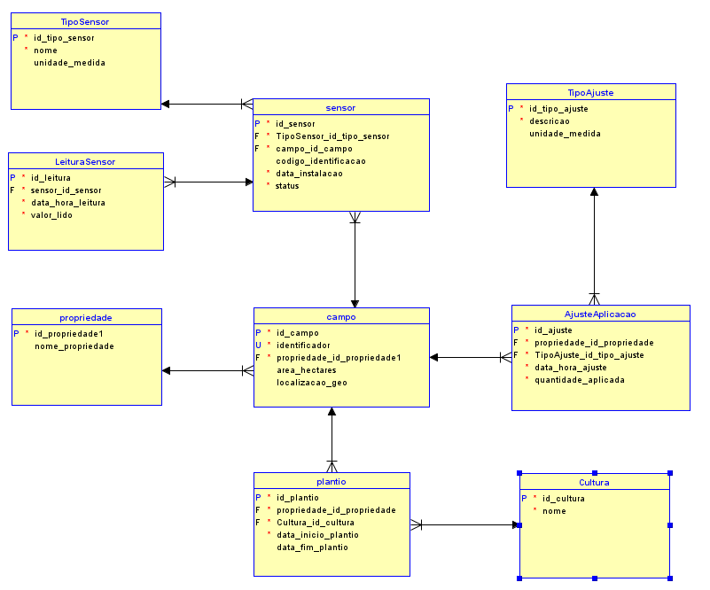

# FIAP - Faculdade de Informática e Administração Paulista

 

# Um mapa do tesouro

## Grupo 28

## 👨‍🎓 Integrantes: 
- Vide arquivo separado na entrega no sistema da FIAP
## 👩‍🏫 Professores:
### Tutor(a) 
- <a href="https://www.linkedin.com/company/inova-fusca">Lucas Gomes Moreira</a>
### Coordenador(a)
- <a href="https://www.linkedin.com/company/inova-fusca">André Godoi</a>

## 📜 Descrição

Este projeto visa modelar um banco de dados relacional para a FarmTech Solutions. O objetivo é armazenar e analisar dados coletados por sensores em plantações (umidade, pH, nutrientes P e K) para otimizar a aplicação de água e nutrientes, visando aumentar a produção agrícola.

O banco de dados deve permitir responder perguntas como:
* Qual foi a quantidade total de água aplicada em cada mês, por campo?
* Como variou o nível de pH do solo em um campo específico ao longo do ano?
* Quais campos apresentaram níveis de nutrientes (P ou K) fora do ideal para a cultura atual?
* Qual o histórico de leituras de um sensor específico?
* Quais sensores estão ativos e onde estão instalados?

## 📜 Modelo Entidade-Relacionamento (MER)

### Entidades e Atributos

* **Propriedade**
    * `id_propriedade`: Integer (PK, Not Null)
    * `nome_propriedade`: VARCHAR(100)

* **Campo** (Representa o Talhão/Lote)
    * `id_campo`: Integer (PK, Not Null)
    * `id_propriedade`: Integer (FK, Not Null) - Ref: Propriedade
    * `identificador`: VARCHAR(100) (Unique, Not Null)
    * `area_hectares`: NUMERIC
    * `localizacao_geo`: SDO_GEOMETRY (ou VARCHAR)

* **TipoSensor**
    * `id_tipo_sensor`: Integer (PK, Not Null)
    * `nome`: VARCHAR(100) (Not Null)
    * `unidade_medida`: VARCHAR(20) (Not Null)

* **Sensor**
    * `id_sensor`: Integer (PK, Not Null)
    * `id_tipo_sensor`: Integer (FK, Not Null) - Ref: TipoSensor
    * `id_campo`: Integer (FK, Not Null) - Ref: Campo
    * `codigo_identificacao`: VARCHAR(100) (Unique, Not Null)
    * `data_instalacao`: DATE (Not Null)
    * `status`: VARCHAR(20) (Not Null)

* **LeituraSensor**
    * `id_leitura`: Integer (PK, Not Null)
    * `id_sensor`: Integer (FK, Not Null) - Ref: Sensor
    * `data_hora_leitura`: TIMESTAMP (Not Null)
    * `valor_lido`: NUMERIC(12, 4) (Not Null)

* **Cultura**
    * `id_cultura`: Integer (PK, Not Null)
    * `nome`: VARCHAR(100) (Not Null)
    * `nome_cientifico`: VARCHAR(150) (Opcional)

* **Plantio** (Entidade Associativa: Campo <-> Cultura)
    * `id_plantio`: Integer (PK, Not Null)
    * `id_campo`: Integer (FK, Not Null) - Ref: Campo
    * `id_cultura`: Integer (FK, Not Null) - Ref: Cultura
    * `data_inicio_plantio`: DATE (Not Null)
    * `data_fim_plantio`: DATE

* **TipoAjuste**
    * `id_tipo_ajuste`: Integer (PK, Not Null)
    * `descricao`: VARCHAR(100) (Not Null)
    * `unidade_medida`: VARCHAR(20) (Not Null)

* **AjusteAplicacao**
    * `id_ajuste`: Integer (PK, Not Null)
    * `id_campo`: Integer (FK, Not Null) - Ref: Campo
    * `id_tipo_ajuste`: Integer (FK, Not Null) - Ref: TipoAjuste
    * `data_hora_ajuste`: TIMESTAMP (Not Null)
    * `quantidade_aplicada`: NUMERIC (Not Null)
    * `observacoes`: VARCHAR(500) (Opcional)

*(Adapte os tipos VARCHAR, NUMERIC etc. se usou outros)*

### Relacionamentos Principais

* Propriedade (1) -- (0,N) Campo
* Campo (1) -- (0,N) Sensor
* Campo (1) -- (0,N) Plantio
* Campo (1) -- (0,N) AjusteAplicacao
* TipoSensor (1) -- (0,N) Sensor
* Sensor (1) -- (0,N) LeituraSensor
* Cultura (1) -- (0,N) Plantio
* TipoAjuste (1) -- (0,N) AjusteAplicacao

## Diagrama Entidade-Relacionamento (DER)

O diagrama visual abaixo representa a estrutura final do banco de dados:

## Script SQL (DDL)

O script para criação das tabelas no banco de dados Oracle, pode ser encontrado neste arquivo:
[FarmTech_Schema.ddl](assets/FarmTech_Schema.ddl)

## 📁 Estrutura de pastas

Dentre os arquivos e pastas presentes na raiz do projeto, definem-se:

- <b>.github</b>: Nesta pasta ficarão os arquivos de configuração específicos do GitHub que ajudam a gerenciar e automatizar processos no repositório.

- <b>assets</b>: aqui estão os arquivos relacionados a elementos não-estruturados deste repositório, como imagens.

- <b>README.md</b>: arquivo que serve como guia e explicação geral sobre o projeto (o mesmo que você está lendo agora).

## 🔧 Como executar o código

*Importar o arquivo assets/FarmTech_Schema.ddl no Oracle Data Modeler.*

## 🗃 Histórico de lançamentos

* 0.1.0 - 14/04/2024
    *

## 📋 Licença

<a property="dct:title" rel="cc:attributionURL" href="https://github.com/agodoi/template">MODELO GIT FIAP</a> por <a rel="cc:attributionURL dct:creator" property="cc:attributionName" href="https://fiap.com.br">Fiap</a> está licenciado sobre <a href="http://creativecommons.org/licenses/by/4.0/?ref=chooser-v1" target="_blank" rel="license noopener noreferrer" style="display:inline-block;">Attribution 4.0 International</a>.

